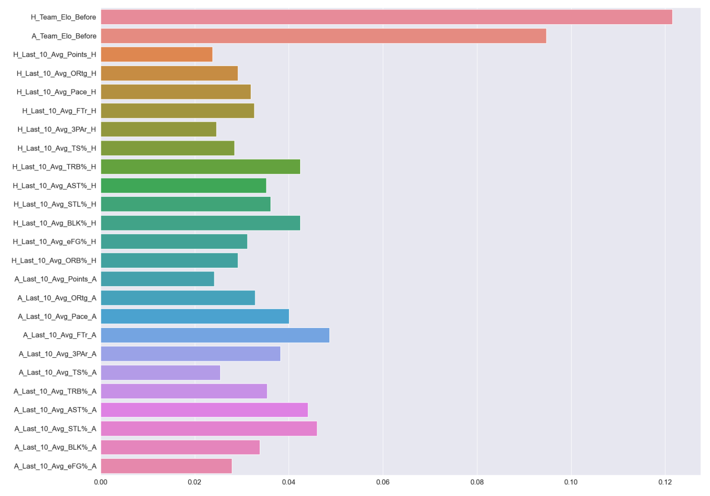

# Using Elo to Predict Wins/Losses in the NBA

Ripton Rosen

# Description

This project aims to implement an Elo metric to predict the outcome of basketball games and predict scores to pit against sports betting lines.  

# Data

The data was acquired through [Basketball-Reference](https://www.basketball-reference.com/) game logs for all 30 NBA teams, including the 7 of whom that have changed names or cities.  This included all of the basic and advanced statistics from the 2009-2010 to 2019-2020 seasons.  

# Data Cleaning and Dataframe Manipulation

The data scrubbing, and even more so the dataframe manipulation, was the most time consuming part of the project.   The first step was to web scrape and separate the basic metrics and advanced metrics:

Multiple columns had to be renamed, dropped, or given integer values.  After splitting the dataframe apart into basic and advanced srtatistics, I had to break it down to home and away statistics for each team.  

**Basic Stats Dataframe**

**Advanced Stats Dataframe**

After this, I used a function to generate an Elo statistic for each team. Elo takes in the final score of each game, when and where it was played.  Teams are given a number of points based on a win or a loss.  Winning away games and winning by large margins allot more points to a team.  For reference, an average team's Elo is 1500.  [Fivethirtyeight.com](https://projects.fivethirtyeight.com/complete-history-of-the-nba/#lakers) used this metric to do an interactive time series on every NBA team to show their relative strengths throughout the history of each franchise.  Columns for **Home Team Elo** before and after, and **Away Team Elo** before and after were attached to each team and would be calculated on a rolling basis throughout each season.

The final step was to average out each team's last 10 games at any given point in a season.  This was performed through functions on each dataframe, basic and advanced as well as on each teams' Elo.  The reason that this is done is for the classification models.  If the statistics from each game log, home team and away team, were to run against each other, the model would look at one or two metrics only to determine the outcome of games.  This was realized after running through some models without aggregating the teams' statistics and seeing that the model would only take into account **Offensive Rating** and **Defensive Rating** for advanced statistics and **Field Goals** for basic statistics.  Averaging out the last 10 games worth of statistics and pitting them against the other teams' is vital.  

# Data Exploration

Now that the dataframes have been broken apart, Elo added and last 10 games averaged, I created covariance matrices for each dataframe in order to see whether there was any multicollinearity between statistics.  
**Basic Covariance Matrix**

**Advanced Covariance Matrix**

I then ran a few vanilla models to check out the feature importance:

**Basic Feature Importance**

**Advanced Feature Importance**

We can clearly see that **Elo Before** for both home and away teams and in both basic and advanced dataframes are extremely important, but the other metrics are still being accounted for.  This is to be expected since Elo is the relative strength of a team at a certain point in time.  

# Models

I ran six different models:
* K-Nearest Neighbors
* Decision Tree
* Random Forest
* Logistic Regression
* Support Vector Machine
* XGBoost

Each dataframe had these models ran on them.  I then decided to tune the Support Vector Machine, Logistic Regression and XGBoost models to see whether I could get a higher accuracy from them.  The Support Vecotr Machine and Linear Regression models had the highest accuracy using both advanced and basic statistics, with the basic statistics dataframe outperforming the advanced statistics. 

**Basic Model Values**

**Advanced Model Values**

# Interpretation

The tuned Support Vector Machine with advanced statistics was able to correctly predict NBA outcomes at a 66.89% accuracy, while Logistic Regression model using basic statistics was able to predict at a 67.72% accuracy.  For predicting the outcome of basketball games, this is quite good.  Single basketball players have a huge impact on the outcome of games, and this model does not take into account whether a player is out with an injury or not. 

# Conclusion and Further Work

There is more that can be done with this project as our understanding of basketball grows.  At some point, defensive metrics will be good enough to include in models so as to get an even better idea of how to predict the outcome of games, let alone gain a better understanding in general.  Something I'd like to do with the project is to also merge in data from the playoffs for each of the years my dataframe spans.  A final piece that I can implement is a dataframe that shows the actual score versus the predicted score and see just how far off each predicted score was.
